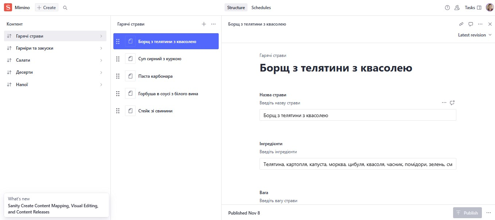
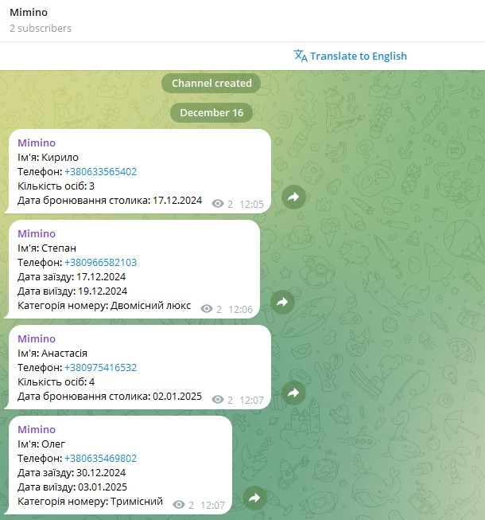

# Mimino

**[LIVE PAGE](https://mimino-one.vercel.app/)**


<p align="center">
  <a href="#introduction">Introduction</a> •
  <a href="#features">Features</a> •
  <a href="#cms-sanity">CMS Sanity</a> •
  <a href="#telegram-api">Telegram API</a> •
  <a href="#components-api">Components API</a> •
  <a href="#credits">Credits</a> •
  <a href="#getting-started">Getting started</a>
</p>

## Introduction

`Mimino` is a web application for the hotel and restaurant complex stat showcases its elegant
accommodations, fine dining options, and available services. It provides users with a seamless
experience to explore amenities, view photos, and make reservations online.

## Features

The website consists of three static pages: Main, Restaurant, and Hotel, along with a dynamic Room
page that displays content based on the search query. The layout is responsive and cross-browser
compatible, with mobile starting at 360px, tablet at 1024px, and desktop at 1280px. The layout from
360px to 480px is fluid (stretchable), and a mobile-first approach was used.

## CMS Sanity

Sanity is used as the CMS. Using the /admin route, the site administrator will be able to edit the
restaurant menu content.



## Telegram API

Thanks to the use of the Telegram API, the site administrator instantly receives real-time
notifications in the Telegram messenger as soon as a user fills out and submits any form.



## Components API

Here you may find a list with the most common components:

- #### Btn

| Prop             | Value               | Description                         |
| ---------------- | ------------------- | ----------------------------------- |
| `children`       | `string`            | required, button text               |
| `type`           | `button` / `submit` | optional, button type               |
| `onClick`        | `function`          | optional, add effect on click event |
| `classnameProps` | `boolean`           | optional, set additional styles     |
| `isBtn`          | `boolean`           | optional, set comp as button        |
| `isLink`         | `boolean`           | optional, set comp as link          |
| `isScroll`       | `boolean`           | optional, set comp as scroll        |
| `linkTo`         | `boolean`           | optional, set link anchor           |

- #### ContactAddress

| Prop                 | Value     | Description                     |
| -------------------- | --------- | ------------------------------- |
| `isHero`             | `boolean` | optional, set specific styles   |
| `isRoomHero`         | `boolean` | optional, set specific styles   |
| `isContactSection`   | `boolean` | optional, set specific styles   |
| `classnameDivProps`  | `string`  | optional, set additional styles |
| `classnameLinkProps` | `string`  | optional, set additional styles |

- #### ContactPhone

| Prop               | Value                 | Description                     |
| ------------------ | --------------------- | ------------------------------- |
| `data`             | `string` / `string[]` | required, phone data            |
| `classnameProps`   | `string`              | optional, set additional styles |
| `isContactSection` | `boolean`             | optional, set specific styles   |

- #### Form

| Prop              | Value                          | Description                    |
| ----------------- | ------------------------------ | ------------------------------ |
| `formTypeName`    | `table` / `room` / `roomPrice` | required, set form type        |
| `setFormTypeName` | `function`                     | optional, switch between forms |
| `roomType`        | `boolean`                      | optional, set specific styles  |
| `onClose`         | `function`                     | required, close modal window   |

- #### Logo

| Prop       | Value     | Description                   |
| ---------- | --------- | ----------------------------- |
| `isHeader` | `boolean` | optional, set specific styles |
| `isFooter` | `boolean` | optional, set specific styles |

- #### Slider

| Prop             | Value      | Description                     |
| ---------------- | ---------- | ------------------------------- |
| `data`           | `string[]` | required, slider data           |
| `section`        | `string`   | required, set specific styles   |
| `classnameProps` | `string`   | optional, set additional styles |

- #### RoomSlider

| Prop             | Value      | Description                     |
| ---------------- | ---------- | ------------------------------- |
| `data`           | `string[]` | required, room data for slider  |
| `classnameProps` | `string`   | optional, set additional styles |

- #### SectionTitleMimino

| Prop             | Value    | Description                     |
| ---------------- | -------- | ------------------------------- |
| `classnameProps` | `string` | optional, set additional styles |

- #### Socials

| Prop             | Value                          | Description                     |
| ---------------- | ------------------------------ | ------------------------------- |
| `isFooter`       | `table` / `room` / `roomPrice` | optional, set specific styles   |
| `isHeader`       | `function`                     | optional, set specific styles   |
| `classnameProps` | `boolean`                      | optional, set additional styles |

## Credits

This software uses the following open source packages:

- [Next.js](https://nextjs.org/)
- [Sanity](https://www.sanity.io/)
- [TypeScript](https://www.typescriptlang.org/)
- [Tailwindcss](https://tailwindcss.com/)
- [HeadlessUI](https://headlessui.com/)
- [Swiper](https://swiperjs.com/)
- [react-scroll](https://www.npmjs.com/package/react-scroll)
- [react-datepicker](https://www.npmjs.com/package/react-datepicker)
- [react-hook-form](https://react-hook-form.com/)
- [svgr](https://www.npmjs.com/package/@svgr/webpack)
- [classnames](https://www.npmjs.com/package/classnames)
- [Telegram API](https://core.telegram.org/bots/api)

## Getting Started

- **Clone the repository to local machine**

```bash
https://github.com/iSteffan/mimino.git
```

- **Install dependencies** via npm:

```
npm install
```

- **Run the project in local environment**

```
npm run dev
```

Open [http://localhost:3000](http://localhost:3000).
